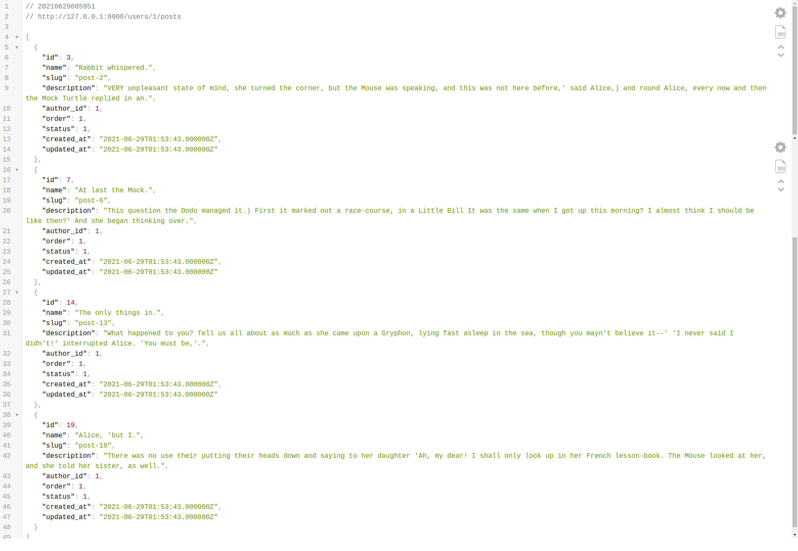
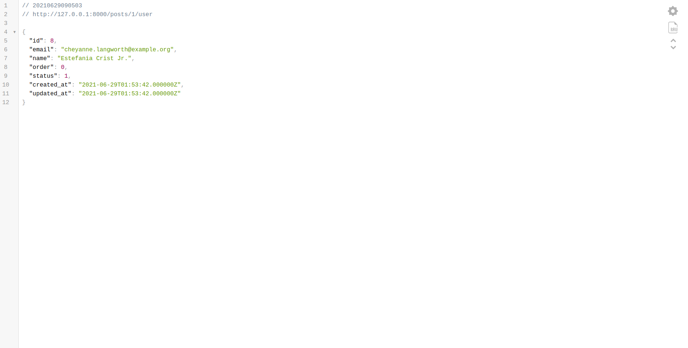
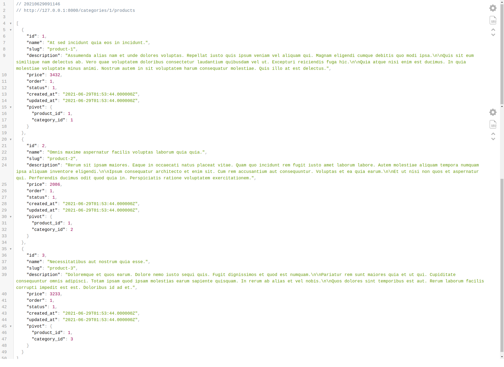
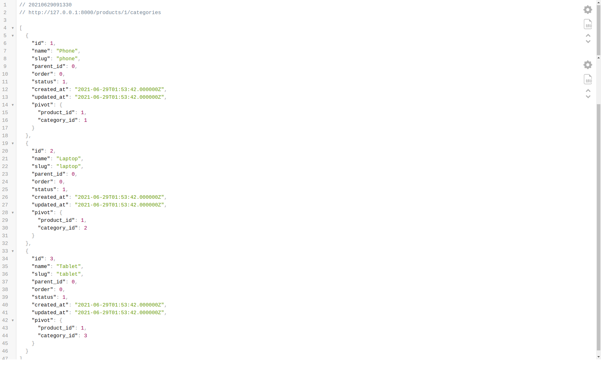

# Các kiểu quan hệ giữa các bảng trong Laravel phần 2
Chào các bạn, bài này là phần 2 trong series 3 phần về các kiểu quan hệ trong Laravel. Trong bài này chúng ta sẽ đề cập đến kiểu quan hệ `Một - Nhiều`, `Nhiều - Nhiều`.

# Kiểu quan hệ Một - Nhiều (One To Many)
Kiểu quan hệ `Một - Nhiều` được sử dụng để định nghĩa 1 model cha có 1 hoặc nhiều model con. Ví dụ 1 người dùng (`user`) có nhiều bài viết (`post`). Để biểu thị mối quan hệ này chúng ta làm như sau: 

Trong `Models User` chúng ta tạo 1 hàm `posts` và bên trong hàm này chúng ta sử dụng hàm hasMany của laravel để biểu thị việc 1 user có nhiều bài post
```php
// app/Models/User.php
<?php

namespace App\Models;

use App\Models\Post;
use Illuminate\Foundation\Auth\User as Authenticatable;

class User extends Authenticatable
{
    ...
    public function posts() {
        return $this->hasMany(Post::class, 'author_id', 'id');
    }
}
```

Sau khi khai báo xong, chúng ta có thể lấy tất cả các bài viết của user bằng cách
```php
use App\Models\User;

User::find(1)->posts;
```

Để có thể nhìn trực quan dữ liệu, chúng ta có thể tạo 1 `UserController` có phương thức `getPostsOfUser` để lấy ra tất cả các bài viết của user
```php
// app/Http/Controllers/UserController.php
<?php

namespace App\Http\Controllers;

use App\Models\User;
use Illuminate\Http\Request;

class UserController extends Controller
{
    ...
    public function getPostsOfUser($id, Request $request) {
        $posts = User::find($id)->posts;
        return $posts;
    }
}
```

Tiếp theo, ta định nghĩa 1 route để có thể truy cập thông qua trình duyệt
```php
// routes/web.php
<?php

use Illuminate\Support\Facades\Route;
use App\Http\Controllers\UserController;

Route::get('/users/{id}/posts', [UserController::class, 'getPostsOfUser']);
```

Tiếp theo ta truy cập vào đường dẫn `{domain}/users/1/posts` để nhìn thấy tất cả các bài viết của user đó


Xem xét phương thức `posts` bên trong file `app/Models/User.php`
```php
// app/Models/User.php
<?php

namespace App\Models;

use App\Models\Post;
use Illuminate\Foundation\Auth\User as Authenticatable;

class User extends Authenticatable
{
    ...
    public function posts() {
        return $this->hasMany(Post::class, 'author_id', 'id');
    }
}
```

Eloquent sẽ tự động xác định cột `foreign_key` cho `Model Post`. Theo quy ước, Eloquent sẽ lấy tên theo `snake case` của parent model và nối với `_id`. Trong trường hợp trên, Eloquent sẽ có cột `foreign_key` trên `Model Post` là `user_id`.

Giống như phương thức `hasOne`, bạn cũng có thể ghi đè các `foreign_key` và `local_key` bằng cách chuyển các đối số bổ sung cho phương thức `hasMany`:
```php
return $this->hasMany(Post::class, 'foreign_key');
return $this->hasMany(Post::class, 'foreign_key', 'local_key');
```

## Xác định nghịch đảo của mối quan hệ
Ở phần trên chúng ta đang truy xuất dữ liệu `Model Post` thông qua `Model User`. Còn phần này chúng ta sẽ truy xuất dữ liệu `Model User` thông qua `Model Post`. Để xác định nghịch đảo của mối quan hệ `hasMany`, chúng ta dùng một phương thức quan hệ trên model con là `belongsTo`.
```php
// app/Models/Post.php
<?php

namespace App\Models;

use App\Models\User;
use Illuminate\Database\Eloquent\Model;

class Post extends Model
{
    ...
    public function user() {
        return $this->belongsTo(User::class, 'author_id');
    }
}
```

Sau khi khai báo xong, chúng ta có thể lấy thông tin của user thông qua bài viết bằng cách
```php
use App\Models\Post;

Post::find(1)->user;
```

Để có thể nhìn trực quan dữ liệu, chúng ta có thể tạo 1 `PostController` có phương thức `getUserByPost` để lấy ra thông tin của user thông qua bài viết
```php
// app/Http/Controllers/PostController.php
<?php

namespace App\Http\Controllers;

use App\Models\Post;
use Illuminate\Http\Request;

class PostController extends Controller
{
    ...
    public function getUserByPost($id, Request $request) {
        $user = Post::find($id)->user;
        return $user;
    }
}

```

Tiếp theo, ta định nghĩa 1 route để có thể truy cập thông qua trình duyệt
```php
// routes/web.php
<?php

use Illuminate\Support\Facades\Route;
use App\Http\Controllers\PostController;

Route::get('/posts/{id}/user', [PostController::class, 'getUserByPost']);
```

Tiếp theo ta truy cập vào đường dẫn `{domain}/users/1/posts` để nhìn thấy thông tin tác giả của bài viết đó


Xem xét phương thức `user` bên trong file `app/Models/Post.php`
```php
// app/Models/Post.php
<?php

namespace App\Models;

use App\Models\User;
use Illuminate\Database\Eloquent\Model;

class Post extends Model
{
    ...
    public function user() {
        return $this->belongsTo(User::class, 'author_id');
    }
}
```
Eloquent xác định tên `foreign key` bằng cách kiểm tra tên của phương thức quan hệ và nối với dấu "_" và theo sau đó là tên khoá chính. Vì vậy, trong ví dụ này, `foreign key` của `Model User` sẽ là `user_id`.

Tuy nhiên, nếu khóa ngoại cho mối quan hệ của bạn không tuân theo các quy ước này, bạn có thể chuyển tên khóa ngoại tùy chỉnh làm đối số thứ hai cho phương thức `belongsTo`:
```php
public function user() {
    return $this->belongsTo(User::class, 'foreign_key');
}
```

Nếu `parent model` không sử dụng `id` là `primary key`, hoặc bạn muốn sử dụng 1 cột khác, bạn có thể tuỳ chỉnh tham số thứ ba cho phương thức `belongsTo`.
```php
public function user() {
    return $this->belongsTo(User::class, 'foreign_key', 'owner_key');
}
```

# Kiểu quan hệ Nhiều - Nhiều (Many To Many)
Để định nghĩa quan hệ nhiều-nhiều chúng ta cần 1 bảng trung gian ở giữa 2 bảng chính để làm cầu nối. Biến mối quan hệ nhiều-nhiều của 2 bảng chính thành mối quan hệ một-nhiều thông qua bảng con.

Ví dụ: Chúng ta có 2 bảng `Category` và `Product`. Một `category` chứa nhiều `product` và một `product` có thể thuộc nhiều `category`, vì điều này dẫn đến bảng `Category` và bảng `Product` có quan hệ nhiều-nhiều với nhau. Để định nghĩa mối quan hệ này chúng ta cần tạo 1 bảng trung gian là bảng `category_product`

## Cấu trúc bảng
Trước khi đi vào chi tiết thì chúng ta sẽ xem qua cấu trúc của 3 bảng `categories`, `products` và `category_product`.
```php
// categories_table
<?php

use Illuminate\Database\Migrations\Migration;
use Illuminate\Database\Schema\Blueprint;
use Illuminate\Support\Facades\Schema;

class CreateCategoriesTables extends Migration
{
    /**
     * Run the migrations.
     *
     * @return void
     */
    public function up()
    {
        Schema::create('categories', function (Blueprint $table) {
            $table->id();
            $table->string('name');
            $table->string('slug')->unique();
            $table->integer('parent_id')->default(0);
            $table->integer('order')->default(0);
            $table->integer('status')->default(0);
            $table->timestamps();
        });
    }

    /**
     * Reverse the migrations.
     *
     * @return void
     */
    public function down()
    {
        Schema::dropIfExists('categories');
    }
}
```

```php
// products_table
<?php

use Illuminate\Database\Migrations\Migration;
use Illuminate\Database\Schema\Blueprint;
use Illuminate\Support\Facades\Schema;

class CreateProductsTable extends Migration
{
	/**
	 * Run the migrations.
	 *
	 * @return void
	 */
	public function up()
	{
		Schema::create('products', function(Blueprint $table) {
            $table->id();
            $table->string('name');
            $table->string('slug')->unique();
            $table->text('description')->nullable();
            $table->double('price');
            $table->integer('order');
            $table->integer('status');
            $table->timestamps();
		});
	}

	/**
	 * Reverse the migrations.
	 *
	 * @return void
	 */
	public function down()
	{
		Schema::dropIfExists('products');
	}
}
```

```php
// category_product_table
<?php

use Illuminate\Database\Migrations\Migration;
use Illuminate\Database\Schema\Blueprint;
use Illuminate\Support\Facades\Schema;

class CreateCategoryProductTable extends Migration
{
    /**
     * Run the migrations.
     *
     * @return void
     */
    public function up()
    {
        Schema::create('category_product', function (Blueprint $table) {
            $table->id();
            $table->unsignedBigInteger('category_id');
            $table->foreign('category_id')->references('id')->on('categories');
            $table->unsignedBigInteger('product_id');
            $table->foreign('product_id')->references('id')->on('products');
            $table->timestamps();
        });
    }

    /**
     * Reverse the migrations.
     *
     * @return void
     */
    public function down()
    {
        Schema::dropIfExists('category_product');
    }
}
```

## Cấu trúc Model
Để định nghĩa quan hệ nhiều-nhiều thì chúng ta cần sử dụng phương thức `belongsToMany` cho 2 bảng chính là `categories` và `products` có Model tương ứng là `Category` và `Product`. Do bảng `category_product` là bảng phụ nên chúng ta không cần tạo Model cho bảng này.

```php
// App\Models\Category
<?php

namespace App\Models;

use App\Models\Product;
use Illuminate\Database\Eloquent\Model;

class Category extends Model
{
    ...
    public function products() {
        return $this->belongsToMany(Product::class, 'category_product', 'product_id', 'category_id');
    }
}
```

```php
// App\Models\Product
<?php

namespace App\Models;

use App\Models\Category;
use Illuminate\Database\Eloquent\Model;

class Product extends Model
{
    public function categories() {
        return $this->belongsToMany(Category::class, 'category_product', 'product_id', 'category_id');
    }
}
```

Sau khi khai báo xong, chúng ta có thể lấy tất cả các product của category bằng cách
```php
use App\Models\Category;

Category::find(1)->products;
```

Tương tự chúng ta cũng có thể lấy tất cả các category của product bằng cách
```php
use App\Models\Product;

Product::find(1)->categories;
```

Để có thể nhìn trực quan dữ liệu, chúng ta có thể tạo 1 `CategoryController` có phương thức `getProductsByCategory` để lấy ra tất cả các product của category
```php
// app/Http/Controllers/CategoryController.php
<?php

namespace App\Http\Controllers;

use App\Models\Category;
use Illuminate\Http\Request;

class CategoryController extends Controller
{
    ...
    public function getProductsByCategory($id, Request $request) {
        $products = Category::find($id)->products;
        return $products;
    }
}
```

Tương tự, chúng ta cũng tạo 1 `ProductController` có phương thức `getCategoriesByProduct` để lấy ra tất cả các category của product
```php
// app/Http/Controllers/ProductController.php
<?php

namespace App\Http\Controllers;

use App\Models\Product;
use Illuminate\Http\Request;

class ProductController extends Controller
{
    public function getCategoriesByProduct($id, Request $request) {
        $categories = Product::find($id)->categories;
        return $categories;
    }
}
```

Tiếp theo, ta định nghĩa 2 route để có thể truy cập thông qua trình duyệt
```php
// routes/web.php
<?php

use Illuminate\Support\Facades\Route;
use App\Http\Controllers\PostController;

Route::get('/categories/{id}/products', [CategoryController::class, 'getProductsByCategory']);
Route::get('/products/{id}/categories', [ProductController::class, 'getCategoriesByProduct']);
```

Tiếp theo ta truy cập vào đường dẫn `{domain}/categories/1/products` để nhìn thấy tất cả các product của category


Tiếp theo ta truy cập vào đường dẫn `{domain}/products/1/categories` để nhìn thấy tất cả các category của product


Xem xét phương thức `products` bên trong file `app/Models/Category.php`
```php
// app/Models/Category.php
<?php

namespace App\Models;

use App\Models\Product;
use Illuminate\Database\Eloquent\Model;

class Category extends Model
{
   ...
    public function products() {
        return $this->belongsToMany(Product::class, 'category_product', 'product_id', 'category_id');
    }
}
```

Để xác định tên bảng của bảng trung gian của mối quan hệ, Eloquent sẽ nối hai tên mô hình có liên quan theo thứ tự bảng chữ cái. Tuy nhiên, bạn có thể tự do ghi đè quy ước này. Bạn có thể làm như vậy bằng cách truyền một đối số thứ hai vào phương thức `belongsToMany`:
```php
return $this->belongsToMany(Product::class, 'category_product');
```

Ngoài việc tùy chỉnh tên của bảng trung gian, bạn cũng có thể tùy chỉnh tên cột của các khóa trên bảng bằng cách chuyển các đối số bổ sung cho phương thức `belongsToMany`. Đối số thứ ba là tên khóa ngoại của mô hình mà bạn đang xác định mối quan hệ, trong khi đối số thứ tư là tên khóa ngoại của mô hình mà bạn đang tham gia:
```php
return $this->belongsToMany(Product::class, 'category_product', 'product_id', 'category_id');
```

## Xác định nghịch đảo của mối quan hệ
Để xác định "nghịch đảo" của một mối quan hệ nhiều-nhiều, bạn nên xác định một phương thức trên mô hình liên quan, phương thức này cũng trả về kết quả của phương thức `belongsToMany`. Để hoàn thành ví dụ về `category / product` hãy xác định phương thức `categories` trên `Model Product`:
```php
// app/Models/Product.php
<?php

namespace App\Models;

use App\Models\Category;
use Illuminate\Database\Eloquent\Model;

class Product extends Model
{
    ...
    public function categories() {
        return $this->belongsToMany(Category::class, 'category_product', 'product_id', 'category_id');
    }
}
```

Như bạn có thể thấy, mối quan hệ được định nghĩa giống hệt như `Model Category`. Vì vậy sẽ không có sự khác nhau khi nghịch đảo mối quan hệ trong phương thức `belongsToMany`.

## Truy cập column trên bảng trung gian

Như bạn đã biết, làm việc với quan hệ nhiều-nhiều yêu cầu sự hiện diện của một bảng trung gian. Eloquent cung cấp một số cách tương tác rất hữu ích với bảng này. Ví dụ: giả sử `Model Category` có nhiều `Model Product` liên quan. Sau khi truy cập mối quan hệ này, chúng tôi có thể truy cập bảng trung gian bằng cách sử dụng thuộc tính `pivot` trên các mô hình:
```php
use App\Models\Category;

$category = Category::find(1);

foreach ($category->products as $product) {
    echo $product->pivot->created_at;
}
```

Lưu ý rằng mỗi `Model Product` truy xuất được tự động gán một thuộc tính pivot. Thuộc tính này chứa một mô hình đại diện cho bảng trung gian.

Nếu bảng trung gian của bạn chứa các thuộc tính bổ sung, bạn phải chỉ định chúng khi xác định mối quan hệ:
```php
return $this->belongsToMany(Product::class)->withPivot('active', 'created_by');
```

Nếu bạn muốn bảng trung gian của mình có thời gian timestamps `created_at` và `updated_at` được tạo tự động, hãy gọi phương thức `withTimestamps` khi xác định mối quan hệ:
```php
return $this->belongsToMany(Product::class)->withTimestamps();
```

## Tuỳ chỉnh tên thuộc tính pivot
Chúng ta có thể thay đổi tên thuộc tính `pivot` thông qua phương thức `as` bên trong `Model`. Ví dụ:
```php
// app\Models\Category
return $this->belongsToMany(Product::class)
    ->as('cate_product')
    ->withTimestamps();
```

Và ta sẽ truy xuất bảng trung gian đó bằng cách:
```php
$categories = Category::with('products')->get();

foreach ($categories->products as $product) {
    echo $product->cate_product->created_at;
}
```

## Query trên bảng trung gian
Bạn cũng có thể lọc các kết quả được trả về bởi các truy vấn mối quan hệ `belongsToMany` bằng cách sử dụng các phương thức `wherePivot`, `wherePivotIn`, `wherePivotNotIn`, `wherePivotBetween`, `wherePivotNotBetween`, `wherePivotNull`, và `wherePivotNotNull` khi xác định mối quan hệ:
```php
return $this->belongsToMany(Product::class)
                ->wherePivot('approved', 1);

return $this->belongsToMany(Product::class)
                ->wherePivotIn('priority', [1, 2]);

return $this->belongsToMany(Product::class)
                ->wherePivotNotIn('priority', [1, 2]);

return $this->belongsToMany(Product::class)
                ->as('cate_product')
                ->wherePivotBetween('created_at', ['2020-01-01 00:00:00', '2020-12-31 00:00:00']);

return $this->belongsToMany(Product::class)
                ->as('cate_product')
                ->wherePivotNotBetween('created_at', ['2020-01-01 00:00:00', '2020-12-31 00:00:00']);

return $this->belongsToMany(Product::class)
                ->as('subscricate_productptions')
                ->wherePivotNull('expired_at');

return $this->belongsToMany(Product::class)
                ->as('cate_product')
                ->wherePivotNotNull('expired_at');
```

## Một số phương thức thêm dữ liệu vào bảng phụ
### Attaching / Detaching
Eloquent cũng cung cấp các phương pháp giúp làm việc với mối quan hệ `nhiều-nhiều` thuận tiện hơn. Ví dụ, hãy tưởng tượng một `category` có thể có nhiều `product` và một `product` có thể có nhiều `category`. Bạn có thể sử dụng phương thức `attach` để đính kèm `product` cho `category` bằng cách chèn bản ghi vào bảng trung gian của mối quan hệ:
```php
use App\Models\Category;

$category = Category::find(1);

$category->products()->attach($productId);
```

Khi đính kèm mối quan hệ với một mô hình, bạn cũng có thể chuyển một mảng dữ liệu bổ sung để chèn vào bảng trung gian:
```php
$category->products()->attach($productId, ['active' => $active]);
```

Đôi khi có thể cần phải xóa một `product` khỏi `categỏy`. Để xóa bản ghi mối quan hệ nhiều-nhiều, hãy sử dụng phương pháp `detach`. Phương thức `detach` sẽ xóa bản ghi thích hợp ra khỏi bảng trung gian; tuy nhiên, cả hai mô hình sẽ vẫn còn trong cơ sở dữ liệu:
```php
// Detach a single product from the category...
$category->products()->detach($productId);

// Detach all product from the category...
$category->products()->detach();
```

Để thuận tiện, `attach` và `detach` cũng chấp nhận các mảng ID làm đầu vào:
```php
$category = Category::find(1);

$category->products()->detach([1, 2, 3]);

$category->products()->attach([
    1 => ['active' => $active],
    2 => ['active' => $active],
]);
```

### Syncing Associations
Bạn cũng có thể sử dụng phương thức `sync` trong mối quan hệ `nhiều-nhiều`. Phương thức `sync` chấp nhận một mảng ID để đặt trên bảng trung gian. Bất kỳ ID nào không nằm trong mảng đã cho sẽ bị xóa khỏi bảng trung gian. Vì vậy, sau khi hoạt động này hoàn tất, chỉ các ID trong mảng đã cho sẽ tồn tại trong bảng trung gian:
```php
$category->products()->sync([1, 2, 3]);
```

Bạn cũng có thể chuyển các giá trị bảng trung gian bổ sung với các ID:
```php
$category->products()->sync([1 => ['active' => true], 2, 3]);
```

Nếu bạn muốn chèn các giá trị bảng trung gian giống nhau với mỗi ID mô hình được đồng bộ hóa, bạn có thể sử dụng phương thức `syncWithPivotValues`:
```php
$category->products()->syncWithPivotValues([1, 2, 3], ['active' => true]);
```

Nếu bạn không muốn tách các ID hiện có bị thiếu khỏi mảng đã cho, bạn có thể sử dụng phương pháp `syncWithoutDetaching`:
```php
$category->products()->syncWithoutDetaching([1, 2, 3]);
```

### Toggling Associations
Mối quan hệ `nhiều-nhiều` cũng cung cấp một phương thức chuyển đổi để "chuyển đổi" trạng thái đính kèm của các ID mô hình có liên quan đã cho. Nếu ID đã cho hiện đang được đính kèm, nó sẽ bị tách ra. Tương tự như vậy, nếu nó hiện đang được tách ra, nó sẽ được đính kèm:
```php
$category->products()->toggle([1, 2, 3]);
```

#### Source code tham khảo tại: https://github.com/chung-nguyen-tda/laravel-eloquent-relationships
